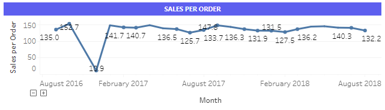

# Brazcommerce
## 1. Background
E-Commerce, sebagai salah satu platform untuk melakukan transaksi jual-beli secara online menjadi tren masa kini. Seiring dengan meningkatnya jumlah pengguna dan transaksi, semakin banyak data yang disimpan. Mulai dari data sales, customer, produk, reseller, dan sebagainya, dapat dimanfaatkan untuk memberikan value kepada perusahaan demi mengoptimalisasi keputusan bisnis. Oleh karena itu, dibutuhkan suatu dashboard yang digunakan untuk membantu mengevaluasi kinerja perusahaan dan mengambil keputusan bisnis secara efektif dan efesien berdasarkan data.
## 2. Objectives
### Vision
Pengoptimalan keputusan bisnis berdasarkan data untuk setiap stakeholders.
### Personas
Persona untuk dashboard ini dibagi menjadi empat dengan detail sebagai berikut:	 

C-Level: Memberikan informasi mengenai performa perusahaan berdasarkan revenue perusahaan dan analisis trend untuk membantu mengambil keputusan strategis.  

Sales team: Memonitor performa penjualan, sales growth dan proporsi penjualan untuk membantu sales team meningkatkan revenue perusahaan  

Marketing team: Mengevaluasi campaign dan mengetahui segmentasi market untuk membantu mengambil keputusan campaign yang efektif dan tepat sasaran 

Business development team: Mengetahui efektifitas eksperimen landing page baru untuk meningkatkan conversion rate 
### Initiatives
Membuat dashboard untuk memonitor matriks bisnis dan membantu mengambil kuputusan efektif dan efesien yang  dapat digunakan oleh C-Level, sales team, marketing team, dan business development team. 
### Features
C-Level: Memperlihatkan gambaran umum performa perusahaan seperti total sales saat ini, tren kenaikan/penurunan sales setiap bulan, dan tren produk terlaris. 

 

Sales: Memberikan informasi mengenai performa penjualan, tren kenaikan/penurunan penjualan, proporsi penjualan, customer review, dan performa seller. 

Marketing: Memberikan informasi mengenai segmentasi market dan evaluasi campaign 

Business Development: Mengevaluasi efektivitas eksperimen landing pages 
## 3. Overview Process
### Userflow
Userflow dibagi sebanyak 4 personas, di mana setiap personas memiliki tujuan masing-masing dan actionable action yang dapat dilakukan setelah melihat dashboard Brazcommerce. 

Untuk C-Level, memiliki kebutuhan untuk mengetahui performa bisnis perusahaan secara general. Untuk sales team, memliki kebutuhan untuk mengevaluasi sales dan mengevaluasi rating. Untuk marketing team, memiliki kebutuhan untuk mengevaluasi campaign dan mengevaluasi segment market. Untuk Business Development team, memiliki kebutuhan untuk melihat hasil A/B Testing.
### Wireframe
Link figma : https://www.figma.com/file/IwvPYt0bMvWNeHRnilspzo/Ecommerce-Brazil-E?node-id=0%3A1 

### Data Wrangling
#### 1. Ekstraksi Dataset
Dataset yang diberikan untuk project ini dibagi untuk masing-masing tim yaitu sales, marketing, dan business development. Terdapat enam dataset untuk sales antara lain order list, order item , order review, order customer order seller, order product dengan format csv. Dataset marketing dan business development masing-masing memiliki satu file format csv. 
#### 2. Wrangling Data Sales
Data sales yang terpisah akan digabungkan untuk mempermudah dalam input di Tableau nantinya. Penggabungan data disesuaikan dengan ‘key’ yang telah diberikan. Berikut adalah beberapa step wrangling data sales:
- Menghapus data null 
- Penggabungan data 
- Menghilangkan underscore dan mengonversi awal kata menjadi huruf besar di kolom product_category_name
- Menerjemahkan bahasa pada kolom product_category_name 

#### 3. Wrangling Data Marketing
Langkah-langkah wrangling data marketing:
- Check null values dari masing-masing features. Didapatkan bahwa kolom Income memiliki null values. Kemudian isi nilai null values pada kolom income dengan nilai median.
- Ubah nilai income dari string menjadi float dengan menggunakan Regex.
- Membuat kategori pendapatan menjadi lower income, middle income, dan upper income menggunakan qcut.
- Membuat kelompok umur berdasarkan generasi traditionalist, baby boomers, gen-x, millennials, dan gen-z. Kelompok umur ditentukan berdasarkan tahun kelahiran.
- Pengolahan data untuk membuat segmentasi customer berdasarkan RFM. Recency ditentukan dari kolom “Recency” yang berarti jumlah hari sejak customer melakukan pembelian terakhir. Frequency ditentukan dari kolom “NumWebPurchases” yang berarti banyaknya pembelian yang dilakukan oleh customer. Monetary didapatkan dengan menjumlahkan total biaya yang dihabiskan untuk masing-masing jenis produk. 
- Mengelompokkan masing-masing RFM menjadi score antara 1-5 menggunakan qcut. Urutan score pada recency terbalik karena semakin besar recency, pengaruhnya semakin buruk terhadap customer value. Setelah itu menggabungkan semua nilai RFM menjadi string. 
- Membuat segmentasi customer berdasarkan nilai recency dan frequency. Adapun aspek monetary akan ditampilkan pada tree maps di dashboard. 
- Export data menjadi file siap digunakan di Tableau.

#### 4. Wrangling Data Business Development
- Cek dan membersihkan data
  - Cek summary data dengan .info()
  - Cek data unik di setiap kolom
  - Cek integritas data di kolom group dan landing_page
  - Membersihkan data
- Data Wrangling
  - Membuat conversion rate trend data
  - Membuat power trend data
  - Membuat data untuk uji statistik keseluruhan dan harian

## 4. MVP Demonstration
Berdasarkan proses pre-processing data dan objective yang telah didefinisikan sebelumnya, berikut link demonstrasi MVP dashboard yang dibuat: 

https://public.tableau.com/app/profile/helmy.satria/viz/Brazcommerce/OverviewDashboard?publish=yes 

### Overview Dashboard
Overview Dashboard menampilkan informasi umum mengenai performa perusahaan yang ditujukan untuk C-Level. Informasi yang ditampilkan berupa total sales, total order, rata-rata rating, jumlah customer, tren penjualan, produk terlaris, dan penjualan di setiap daerah. 
### Sales Dashboard
Sales Dashboard menampilkan informasi detail mengenai performa penjualan yang ditujukan untuk team sales. Informasi yang ditampilkan berupa total sales, total order, total produk, total customer, total seller, tren penjualan dan prediksinya, sales per order, penjualan berdasarkan bulan dan jam, rating, dan sales growth. 
### Marketing Dashboard
Marketing Dashboard menampilkan informasi mengenai efektivitas campaign dan segmentasi market yang ditujukan untuk team marketing. Informasi yang ditampilkan berupa campaign acceptance rate, overall campaign, web conversion rate, segmentasi demografi berdasarkan grup usia, marital status, grup pendapatan, dan Pendidikan. Kemudian ditampilkan juga segmentasi market berdasarkan RFM yang dikategorikan menjadi 10 grup dan detail segmentasinya berdasarkan demografi. 
### Business Development Dashboard 
Bizdev Dashboard menampilkan informasi mengenai efektivitas landing page yang baru dan yang lama. Informasi yang ditampilkan berupa total sample, control group percentage, treatment group percentage, overall analysis, conclusion and recommendation, tren conversion rate harian, dan tren nilai p-value dan power harian. 

## 5. Analisis
### Analisis C-Level
Pada dashboard overview kita dapat mengambil beberapa pandangan. Grafik trend sales yang cenderung naik namun masih ada penurunan sales di beberapa bulan. Penurunan itu bisa dijadikan acuan untuk menaikkan sales di bulan berikutnya. Sebagai contoh, mengadakan penawaran menarik dengan menggabungkan produk unggulan yang ditampilkan di top produk. Selain itu, pada bagian sales per region, sales hanya terfokus pada region yang notabene adalah perkotaan. Dapat diambil keputusan bisnis selanjutnya bagaimana cara menjangkau keseluruhan region. Contoh kasarnya, perusahaan dapat melakukan kampanye diskon atau gratis ongkos kirim (ongkir). Ketika customer yang jauh dari perkotaan membeli barang dari perkotaan akan sangat terbantu dengan ongkir yang diskon ataupun gratis. 

### Analisis Sales
Terdapat 2 objective yang diperlukan oleh user, yaitu:
- Untuk mengevaluasi kinerja sales, sehingga dibuat strategi sales yang berguna untuk meningkatkan penjualan 
- Untuk mengevaluasi rating, sehingga dibuat strategi yang sesuai untuk meningkatkan rating

Kinerja sales pada bulan berjalan dapat dilihat pada metric berbentuk card yang berisi total sales, total order, total product, total customer dan total seller. 

Selain itu, sebagai kontrol, terdapat growth yang dibandingkan dengan bulan sebelumnya. 

Untuk mengetahui tren dan proyeksi sales, dibuat trend dan forecast. 

Pada grafik terlihat bahwa sales yang ada terjadi kenaikan dan diprediksi akan terjadi kenaikan selama 1 tahun selanjutnya. 

Untuk mengetahui efektivitas sales, terdapat tren AOV (Average Order Value) yang didapatkan dari perbandingan total sales dibandingkan dengan total order dari bulan ke bulan. Semakin tinggi AOV nya, maka akan semakin baik kinerja tim sales. 

Pada grafik tersebut, maka didapatkan AOV yang cenderung datar. Untuk meningkatkan revenue, maka grafik AOV harus dinaikkan. Beberapa actionable action yang dapat direkomendasikan adalah dengan cara memberikan promo bundling atau promo dengan minimum pembelian. 

Untuk mengetahui kapan waktu terbanyak untuk sales, maka terdapat metric sales based on month, day and hour. 

Tim sales dapat memberikan insight kepada tim marketing untuk merekomendasikan waktu yang tepat untuk melakukan campaign. 

Untuk mengetahui growth di masing-masing state, terdapat table untuk memberikan informasi growth di masing-masing state. Sales growth pada daerah yang sudah baik dapat direplikasi stratgeinya ke daerah yang belum baik. 

Untuk mengevaluasi rating, maka user dapat melihat proporsi rating pada grafik berikut 

Pada proporsi tersebut, didapatkan bahwa mayoritas rating terdapat pada rating 5. Namun, masih terdapat rating 1 dan 2. Untuk menyelidiki seller mana yang berkontribusi terhadap rating tersebut, maka ketika dihover pada salah satu barchart, maka akan ditampilkan seller dan jumlah rating yang didapat. 

Dari daftar seller tersebut, maka user dapat melakukan pendekatan pada seller tersebut untuk meningkatkan rating. 

### Analisis Marketing

Sebagaimana objective yang telah didefinisikan sebelumnya, ada 3 pertanyaan utama yang dapat dijawab oleh dashboard marketing: 
- Seberapa efektif campaign yang sudah dilakukan? 
- Segmen demografi apa yang tepat untuk dikampanyekan campaign tertentu? 
- Bagaimana cara melakukan treatment pada masing-masing segmen RFM? 

Terkait efektivitas campaign, dapat dilihat dari gambar di bawah ini bahwa dari lima campaign yang dikampanyekan, campaign-4 mendapatkan acceptance rate paling tinggi. Adapun acceptance rate terendah didapatkan oleh campaign-2. Secara umum, tanpa mempertimbangkan jumlah campaign yang dikampanyekan, acceptance rate yang diraih adalah sebesar 20,67%. Selanjutnya, untuk mengetahui berapa banyak orang yang berkunjung ke website kemudian memutuskan untuk membeli, dapat diwakili pada kolom Web Convertion Rate sebesar 76,83%. 

Setelah team marketing mengevaluasi nilai acceptance rate pada masing-masing campaign, berikutnya adalah menjawab pertanyaan, segmen demografi apa yang tepat untuk dikampanyekan campaign tertentu? Hal ini dapat terjawab pada bagian demographic segmentation.  

Sebagai contoh, campaign-5 cocok dikampanyekan untuk customer yang berpenghasilan tinggi. Dapat diamati bahwa tidak ada response sama sekali untuk pendapatan kelas menengah maupun kelas bawah. 

Dilihat dari demografi umur, campaign-5 cocok dikampanyekan untuk generasi baby boomers maupun millennials, namun tidak ada response sama sekali untuk generasi X. 

Selain membahas tentang campaign, team marketing juga perlu melakukan segmentasi customer berdasarkan RFM. Dengan segmentasi tersebut, dapat diketahui perilaku customer yang dikategorikan menjadi 10 kategori. Besarnya kotak pada tree maps tergantung dari rata-rata uang yang dihabiskan oleh masing-masing segmen tersebut (average monetary). Sebagai contoh, kategori Can’t Loose dan Loyal Customers memiliki average monetary paling tinggi. Selain mengetahui segmentasi RFM, team marketing juga perlu melakukan treatment yang tepat pada masing-masing kategori tersebut dengan melakukan hover. Rekomendasi treatment akan ditampilkan dalam bentuk tooltip. 

Sebagai contoh, pada kategori customer yang loyal, hendaknya team marketing tidak perlu terlalu banyak melakukan “spamming” atau terlalu sering mengirim email, rekomendasi, dsb. Sebab dapat mengganggu customer yang pada dasarnya sudah loyal dari awal. Dari tooltip juga kita dapatkan nilai rata-rata recency, frequency, dan monetary. Selain itu kita dapat mengetahui segmen demografi mana yang dominan masuk kategori Loyal customers. Dari gambar dibawah ini didapatkan bahwa orang berpenghasilan menengah dan tinggi yang paling banyak menjadi customer yang loyal. 

### Analisis Business Development

Dari dashboard A/B Testing, users dari business development ingin mengetahui apakah hasil desain landing page baru memiliki kenaikan performa signifikan terhadap conversion rate dibandingkan desain landing page yang lama. Untuk mencapai tujuan tersebut, uji statistik harus dilakukan dengan langkah menentukan hipotesis lalu menghitung p-value. Dalam kasus ini, p-value yang dihasilkan berada di atas 0,05 (alpha) yang berarti uji statistik gagal menolak null hypothesis. 

Untuk melakukan analisis secara harian, users dapat melihat bagaimana trend conversion rate untuk grup control dan treatment. Dapat dilihat bahwa conversion rate dari kedua grup tersebut tidak memiliki perbedaan secara siginifikan. Bahkan, terlihat bahwa conversion rate menggunakan desain lama memiliki nilai yang lebih baik daripada desain baru. 

Selanjutnya, yang menjadi pertanyaan adalah apakah memang minimnya perbedaan conversion rate antara kedua grup dapat didukung juga secara statistika. Analisis statistik harian dapat dilakukan untuk menjawab pertanyaan tersebut. Untuk melihat bagaimana performa uji statistik secara harian, users dapat melihat trend p-value dan power. Dalam kasus ini, diasumsikan hasil uji statistik dianggap robust terhadap error jika power sudah melebihi 80%. Artinya, hasil p-value di setelah tanggal (3 Januari 2017) di mana power melebihi 80% dapat diandalkan untuk mempertanggungjawabkan hasil A/B testing. P-value dari setiap tanggal setelah 3 Januari 2017 tidak pernah turun sampai di bawah 0,05. Ini menunjukkan sedikitnya perbedaan antara conversion rate grup control dan treatment secara harian dapat dibuktikan secara statistika dengan melihat tren harian p-value dan power. 

## 6. Penyusun
1. Ahmad Hawky Dermawan/ ahmadhawky@gmail.com 

2. Brian Rizadhani Latuconsina / brianlatuconsina@gmail.com 

3. Djatmiko Bagus Maulana Erlambang / djatmiko.erlambang@gmail.com 

4. Helmy Satria Martha Putra / helmysmp@gmail.com 

